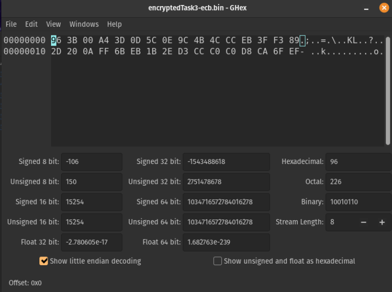
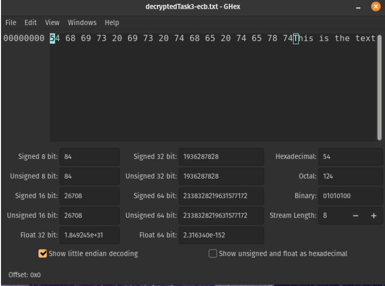
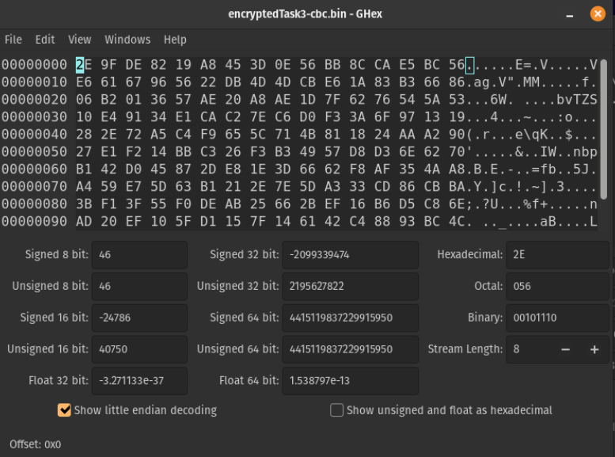
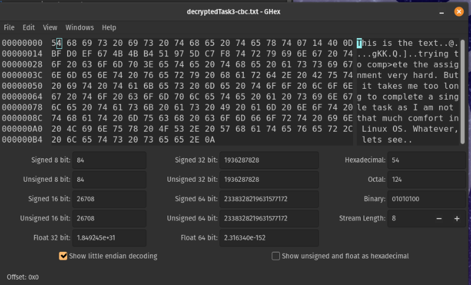
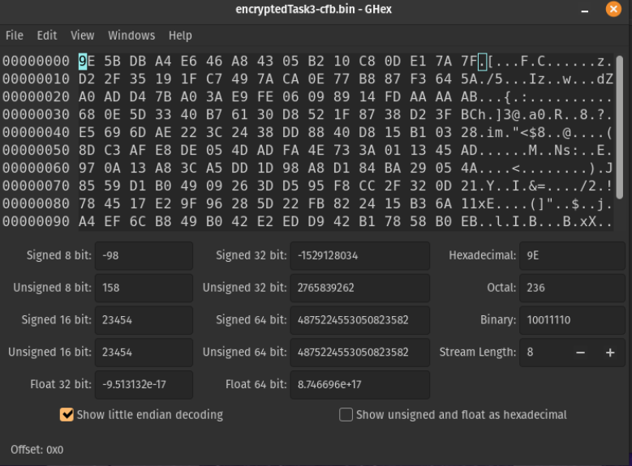
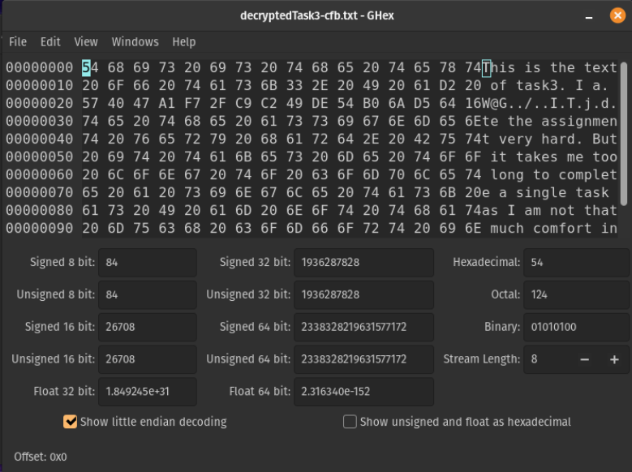
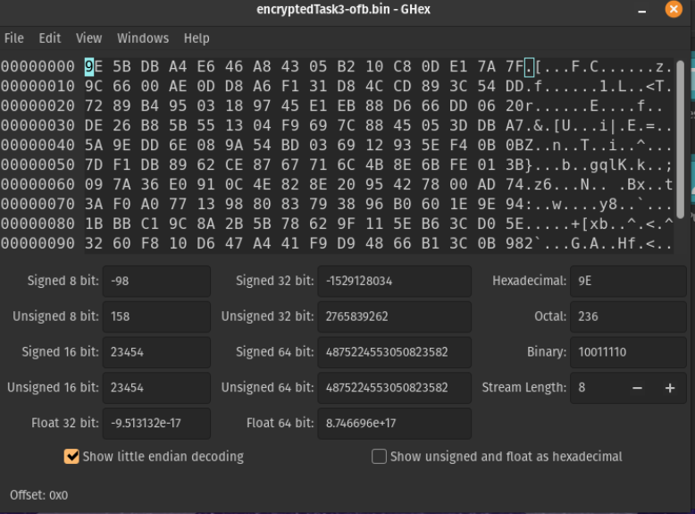
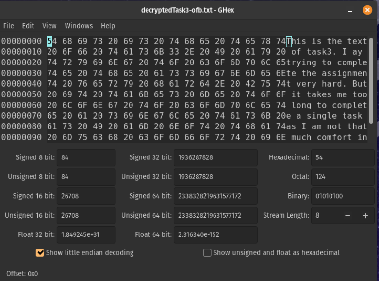

# Task 1

### Using aes-128-cbc :

<b>Encryption Code :</b>
```
openssl enc -aes-128-cbc -e  -in Task1.txt -out Task1-aes-128-cbc.bin \
                 -K  00112233445566778889aabbccddeeff \
                 -iv 01020304050607083241231213124f23
```

<b>Decryption Code :</b>
```
openssl enc -aes-128-cbc -d  -in Task1-aes-128-cbc.bin \
                            -out   decryptedTask1-aes-128-cbc.txt \
                            -K  00112233445566778889aabbccddeeff \
                            -iv 01020304050607083241231213124f23
```

### Using aes-128-ebc :

<b>Encryption Code :</b>
```
openssl enc -aes-128-ebc -e  -in Task1.txt -out Task1-aes-128-ebc.bin \
                 -K  00112233445566778889aabbccddeeff \
                 -iv 01020304050607083241231213124f23
```

<b>Decryption Code :</b>
```
openssl enc -aes-128-ebc -d  -in Task1-aes-128-ebc.bin \
                            -out   decryptedTask1-aes-128-ebc.txt \
                            -K  00112233445566778889aabbccddeeff \
                            -iv 01020304050607083241231213124f23
```

### Using aes-128-ecb :

<b>Encryption Code :</b>
```
openssl enc -aes-128-ecb -e  -in Task1.txt -out Task1-aes-128-ecb.bin \
                 -K  00112233445566778889aabbccddeeff \
                 -iv 01020304050607083241231213124f23
```

<b>Decryption Code :</b>
```
openssl enc -aes-128-ecb -d  -in Task1-aes-128-ecb.bin \
                            -out   decryptedTask1-aes-128-ecb.txt \
                            -K  00112233445566778889aabbccddeeff \
                            -iv 01020304050607083241231213124f23
```


## Task 3

<b>ECB Mode :</b>  

Encryption Code :
```
openssl enc -aes-128-ecb -e  -in Task3.txt -out encryptedTask3-ecb.bin -K 2019831066010203040506070809aabb
```

Corruption at 30 byte :


Decryption Code :
```
openssl enc -aes-128-ecb -d  -in encryptedTask3-ecb.bin -out decryptedTask3-ecb.txt -K 2019831066010203040506070809aabb
```
Decryption text :


<b>CBC Mode :</b>  

Encryption Code :
```
openssl enc -aes-128-cbc -e  -in Task3.txt -out encryptedTask3-cbc.bin \
                 -K  00112233445566778889aabbccddeeff \
                 -iv 01020304050607083241231213124f23
```

Corruption at 30 byte :


Decryption Code :
```
openssl enc -aes-128-cbc -d  -in encryptedTask3-cbc.bin -out decryptedTask3-cbc.txt \
                 -K  00112233445566778889aabbccddeeff \
                 -iv 01020304050607083241231213124f23
```

Decryption text :


<b>CFB Mode :</b>  

Encryption Code :
```
openssl enc -aes-128-cfb -e  -in Task3.txt -out encryptedTask3-cfb.bin \
                 -K  00112233445566778889aabbccddeeff \
                 -iv 01020304050607083241231213124f23
```

Corruption at 30 byte :


Decryption Code :
```
openssl enc -aes-128-cfb -d  -in encryptedTask3-cfb.bin -out decryptedTask3-cfb.txt \
                 -K  00112233445566778889aabbccddeeff \
                 -iv 01020304050607083241231213124f23
```

Decryption text :


<b>OFB Mode :</b>  

Encryption Code :
```
openssl enc -aes-128-ofb -e  -in Task3.txt -out encryptedTask3-ofb.bin \
                 -K  00112233445566778889aabbccddeeff \
                 -iv 01020304050607083241231213124f23
```

Corruption at 30 byte :


Decryption Code :
```
openssl enc -aes-128-ofb -d  -in encryptedTask3-ofb.bin -out decryptedTask3-ofb.txt \
                 -K  00112233445566778889aabbccddeeff \
                 -iv 01020304050607083241231213124f23
```

Decryption text :
