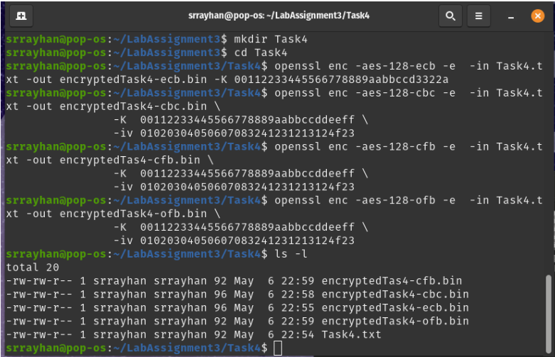

# Task 1

### Using aes-128-cbc :

<b>Encryption Code :</b>
```
openssl enc -aes-128-cbc -e  -in Task1.txt -out Task1-aes-128-cbc.bin \
                 -K  00112233445566778889aabbccddeeff \
                 -iv 01020304050607083241231213124f23
```

<b>Decryption Code :</b>
```
openssl enc -aes-128-cbc -d  -in Task1-aes-128-cbc.bin \
                            -out   decryptedTask1-aes-128-cbc.txt \
                            -K  00112233445566778889aabbccddeeff \
                            -iv 01020304050607083241231213124f23
```

### Using aes-128-ebc :

<b>Encryption Code :</b>
```
openssl enc -aes-128-ebc -e  -in Task1.txt -out Task1-aes-128-ebc.bin \
                 -K  00112233445566778889aabbccddeeff \
                 -iv 01020304050607083241231213124f23
```

<b>Decryption Code :</b>
```
openssl enc -aes-128-ebc -d  -in Task1-aes-128-ebc.bin \
                            -out   decryptedTask1-aes-128-ebc.txt \
                            -K  00112233445566778889aabbccddeeff \
                            -iv 01020304050607083241231213124f23
```

### Using aes-128-ecb :

<b>Encryption Code :</b>
```
openssl enc -aes-128-ecb -e  -in Task1.txt -out Task1-aes-128-ecb.bin \
                 -K  00112233445566778889aabbccddeeff \
                 -iv 01020304050607083241231213124f23
```

<b>Decryption Code :</b>
```
openssl enc -aes-128-ecb -d  -in Task1-aes-128-ecb.bin \
                            -out   decryptedTask1-aes-128-ecb.txt \
                            -K  00112233445566778889aabbccddeeff \
                            -iv 01020304050607083241231213124f23
```


# Task 3

<b>ECB Mode :</b>  

Encryption Code :
```
openssl enc -aes-128-ecb -e  -in Task3.txt -out encryptedTask3-ecb.bin -K 2019831066010203040506070809aabb
```

Corruption at 30 byte :   


Decryption Code :
```
openssl enc -aes-128-ecb -d  -in encryptedTask3-ecb.bin -out decryptedTask3-ecb.txt -K 2019831066010203040506070809aabb
```
Decryption text :   


<b>CBC Mode :</b>  

Encryption Code :
```
openssl enc -aes-128-cbc -e  -in Task3.txt -out encryptedTask3-cbc.bin \
                 -K  00112233445566778889aabbccddeeff \
                 -iv 01020304050607083241231213124f23
```

Corruption at 30 byte :   


Decryption Code :
```
openssl enc -aes-128-cbc -d  -in encryptedTask3-cbc.bin -out decryptedTask3-cbc.txt \
                 -K  00112233445566778889aabbccddeeff \
                 -iv 01020304050607083241231213124f23
```

Decryption text :   


<b>CFB Mode :</b>  

Encryption Code :
```
openssl enc -aes-128-cfb -e  -in Task3.txt -out encryptedTask3-cfb.bin \
                 -K  00112233445566778889aabbccddeeff \
                 -iv 01020304050607083241231213124f23
```

Corruption at 30 byte :   


Decryption Code :
```
openssl enc -aes-128-cfb -d  -in encryptedTask3-cfb.bin -out decryptedTask3-cfb.txt \
                 -K  00112233445566778889aabbccddeeff \
                 -iv 01020304050607083241231213124f23
```

Decryption text :   


<b>OFB Mode :</b>  

Encryption Code :
```
openssl enc -aes-128-ofb -e  -in Task3.txt -out encryptedTask3-ofb.bin \
                 -K  00112233445566778889aabbccddeeff \
                 -iv 01020304050607083241231213124f23
```

Corruption at 30 byte :   


Decryption Code :
```
openssl enc -aes-128-ofb -d  -in encryptedTask3-ofb.bin -out decryptedTask3-ofb.txt \
                 -K  00112233445566778889aabbccddeeff \
                 -iv 01020304050607083241231213124f23
```

Decryption text :   


# Task 4 

<b>Encryption : </b>   
Using ECB mode :     
```
openssl enc -aes-128-ecb -e  -in Task4.txt -out encryptedTask4-ecb.bin -K 00112233445566778889aabbccd3322a
```

Using CBC mode :     
```
openssl enc -aes-128-cbc -e  -in Task4.txt -out encryptedTask4-cbc.bin \
                -K  00112233445566778889aabbccddeeff \
                -iv 01020304050607083241231213124f23
```

Using CFB mode :     
```
openssl enc -aes-128-cfb -e  -in Task4.txt -out encryptedTask4-cfb.bin \
                -K  00112233445566778889aabbccddeeff \
                -iv 01020304050607083241231213124f23
```

Using OFB mode :     
```
openssl enc -aes-128-ofb -e  -in Task4.txt -out encryptedTask4-ofb.bin \
                -K  00112233445566778889aabbccddeeff \
                -iv 01020304050607083241231213124f23
```

Result Analysis :    
   

From the result it is clear that the padding is needed for CBC and ECB algorithm. Cause it makes the size of encrypted file 96 bits which can be devided by 16.


# Task 5

Using SHA-256 :    
```
openssl dgst -sha256 Task5.txt
```

Generated Hash :   
```
SHA2-256(Text5.txt)= 835e350e9d0886d1ceca72baaece3931a5b8fdf32224c5afa10d7b41aff5ab48
```


Using Message Digest 5 :
```
openssl dgst -md5 sample.txt
```

Generated Hash :   
```
MD5(Text5.txt)= b4af4c23b7ef3c3c15ff9156cd9755ab
```


Using SHA-1 :
```
openssl dgst -sha1 Task5.txt
```

Generated Hash :   
```
SHA1(Text5.txt)= 8718bb76a9e832c6911f069c61f82d97a547abbf
```

After ovserving it can say that SHA2-256 is more secure than SHA-1 and MD5. Because it generates longer hash value than others.


# Task 6

Using HMAC-MD5 :
```
openssl dgst -md5 -hmac "abcdefg" Text6.txt
```

Generated Hash :
```
HMAC-MD5(Text6.txt)= a67411e644525c34b904b4eef1281d82
```


Using HMAC-SHA256 :
```
openssl dgst -sha256 -hmac "abc123" Text6.txt
```

Generated Hash :
```
HMAC-SHA2-256(Text6.txt)= 2a6bc51fa7392a0d29565730e0d4fdb49ea05315b372b93dc658c12b7d27b77c
```


Using HMAC-SHA1 :
```
openssl dgst -sha1 -hmac "abc123efg" Text6.txt
```

Generated Hash :
```
HMAC-SHA1(Text6.txt)= ff12ad34be10941bfe55b8ec06e6764ce5b29a44
```