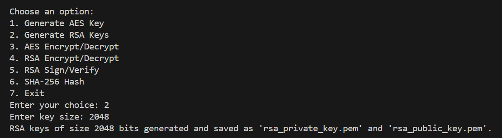
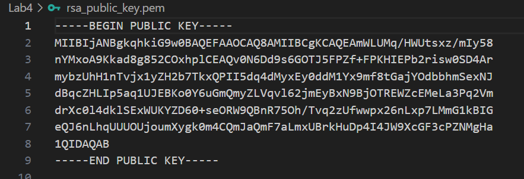
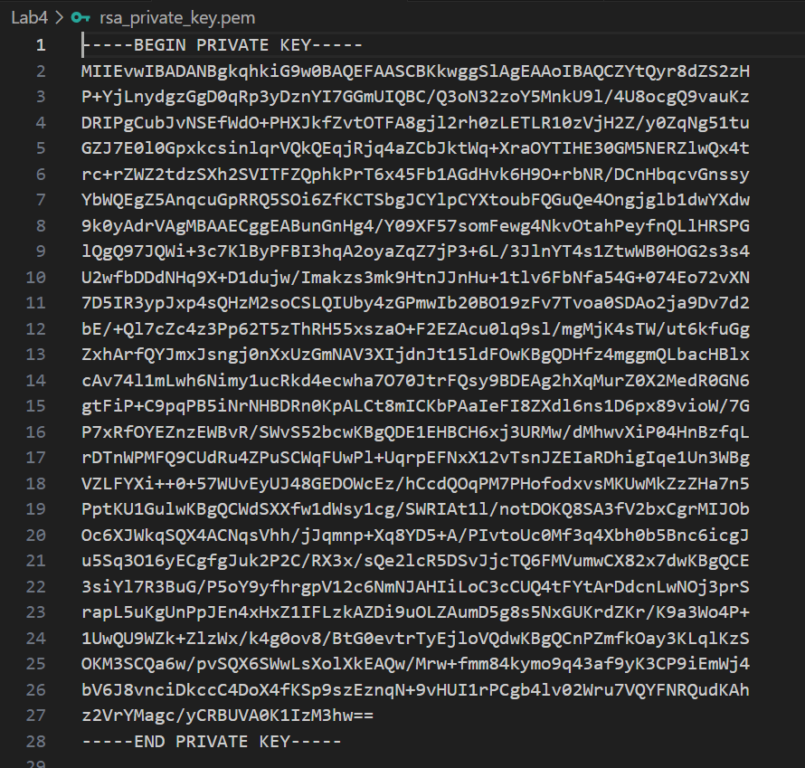
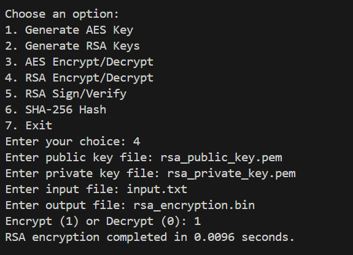
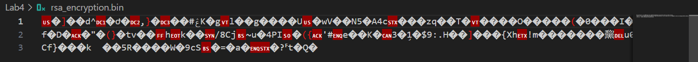
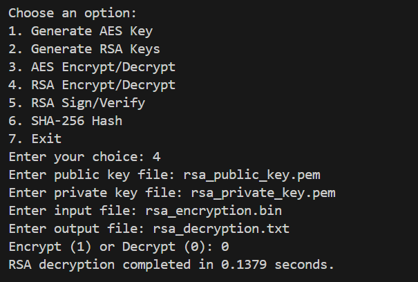
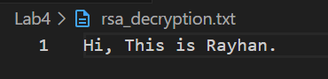
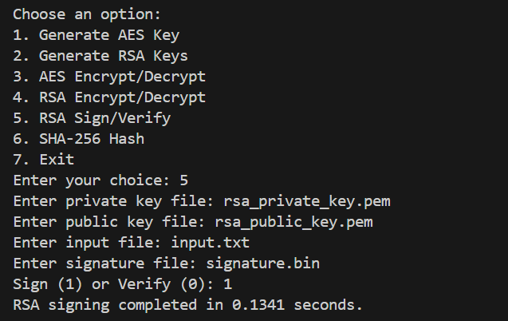
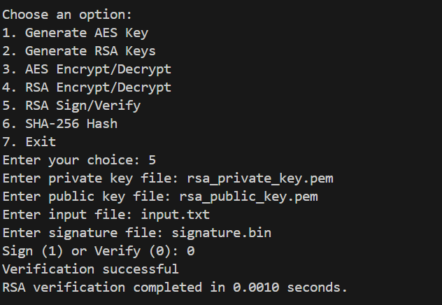
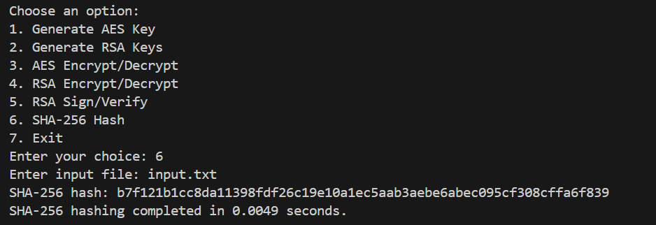

# AES Encryption/Decryption

### Prequisite
For making this whole programm runnable,there is something that need to be imported first.   
By using this command,
```
pip install cryptography
```


### Generating AES Key

For encryption and decryption, we need to generate an AES key. That’s why for 128 bits we create an AES key named `aes_key.bin`.
 
```
def generate_aes_key(key_size):
    return os.urandom(key_size // 8)
```

The generated `aes_key.bin` looks like this,


### Pseudocode for AES Encryption/Decryption

```
def aes_encrypt_decrypt(input_file, output_file, key, mode, iv=None, encrypt=True):
    backend = default_backend()
    block_size = algorithms.AES.block_size

    if mode == 'ECB':
        cipher_mode = modes.ECB()
    elif mode == 'CFB':
        if encrypt:
            if iv is None:
                iv = os.urandom(16)
            cipher_mode = modes.CFB(iv)
        else:
            with open(input_file, 'rb') as f:
                iv = f.read(16)
                ciphertext = f.read()
            cipher_mode = modes.CFB(iv)
    
    cipher = Cipher(algorithms.AES(key), cipher_mode, backend=backend)

    if encrypt:
        encryptor = cipher.encryptor()
        padder = sym_padding.PKCS7(block_size).padder()

        with open(input_file, 'rb') as f:
            plaintext = f.read()

        padded_plaintext = padder.update(plaintext) + padder.finalize()
        ciphertext = encryptor.update(padded_plaintext) + encryptor.finalize()

        with open(output_file, 'wb') as f:
            if mode == 'CFB':
                f.write(iv)
            f.write(ciphertext)
    else:
        decryptor = cipher.decryptor()
        unpadder = sym_padding.PKCS7(block_size).unpadder()

        with open(input_file, 'rb') as f:
            if mode != 'CFB':
                ciphertext = f.read()
            # No need to re-read the file here, already read above
            # ciphertext = f.read()
        
        padded_plaintext = decryptor.update(ciphertext) + decryptor.finalize()
        plaintext = unpadder.update(padded_plaintext) + unpadder.finalize()

        with open(output_file, 'wb') as f:
            f.write(plaintext)
```

### ECB Mode

#### <b>Encryption using 128 Bits.</b>

After that, we have created an input.txt file and encrypt it using ECB 128 bits.


The encrypted file look like this,            


#### <b>Decryption using 128 bits</b>

After decryption,      


The decrypted file,        


#### <b>Encryption using 256 bits</b>

Similarly the process continue in 256 bits,


The encrypted file,


#### <b>Decryption using 256 bits</b>

And the decryption process is,


The decrypted file,


### CFB Mode
Similar process for CFB mode 128 bits and 256 bits.

#### <b>Encryption using 128 bits</b>


#### <b>Decryption using 128 bits</b>


#### <b>Encryption using 256 bits</b>


#### <b>Decryption using 256 bits</b>


# RSA Encryption and Decryption

### Pseudocode of RSA encryption and decryption

```
def rsa_encrypt_decrypt(input_file, output_file, public_key_file, private_key_file, encrypt=True):
    if encrypt:
        with open(input_file, 'rb') as f:
            data = f.read()

        # Generate AES key for encryption
        aes_key = generate_aes_key(256)  # AES-256

        with open(public_key_file, 'rb') as key_file:
            public_key = serialization.load_pem_public_key(
                key_file.read(),
                backend=default_backend()
            )

        # Encrypt AES key with RSA public key
        encrypted_aes_key = public_key.encrypt(
            aes_key,
            padding.OAEP(
                mgf=padding.MGF1(algorithm=hashes.SHA256()),
                algorithm=hashes.SHA256(),
                label=None
            )
        )

        # Encrypt the data with AES
        iv = os.urandom(16)
        cipher = Cipher(algorithms.AES(aes_key), modes.CFB(iv), backend=default_backend())
        encryptor = cipher.encryptor()
        ciphertext = encryptor.update(data) + encryptor.finalize()

        with open(output_file, 'wb') as f:
            f.write(iv)
            f.write(encrypted_aes_key)
            f.write(ciphertext)
    else:
        with open(input_file, 'rb') as f:
            iv = f.read(16)
            encrypted_aes_key = f.read(256)  # Assuming RSA key size is 2048 bits
            ciphertext = f.read()

        with open(private_key_file, 'rb') as key_file:
            private_key = serialization.load_pem_private_key(
                key_file.read(),
                password=None,
                backend=default_backend()
            )

        # Decrypt AES key with RSA private key
        aes_key = private_key.decrypt(
            encrypted_aes_key,
            padding.OAEP(
                mgf=padding.MGF1(algorithm=hashes.SHA256()),
                algorithm=hashes.SHA256(),
                label=None
            )
        )

        # Decrypt the data with AES
        cipher = Cipher(algorithms.AES(aes_key), modes.CFB(iv), backend=default_backend())
        decryptor = cipher.decryptor()
        plaintext = decryptor.update(ciphertext) + decryptor.finalize()

        with open(output_file, 'wb') as f:
            f.write(plaintext)
```

### Generating RSA key



RSA public key,



RSA private key,



### RSA Encryption



Encrypted file,




### RSA Decryption



Decrypted file,




# RSA Signature

### Pseudocode for RSA signature
```
def rsa_sign_verify(input_file, signature_file, private_key_file=None, public_key_file=None, sign=True):
    if sign:
        with open(private_key_file, 'rb') as key_file:
            private_key = serialization.load_pem_private_key(
                key_file.read(),
                password=None,
                backend=default_backend()
            )

        with open(input_file, 'rb') as f:
            data = f.read()

        signature = private_key.sign(
            data,
            padding.PSS(
                mgf=padding.MGF1(hashes.SHA256()),
                salt_length=padding.PSS.MAX_LENGTH
            ),
            hashes.SHA256()
        )

        with open(signature_file, 'wb') as f:
            f.write(signature)
    else:
        with open(public_key_file, 'rb') as key_file:
            public_key = serialization.load_pem_public_key(
                key_file.read(),
                backend=default_backend()
            )

        with open(input_file, 'rb') as f:
            data = f.read()

        with open(signature_file, 'rb') as f:
            signature = f.read()

        try:
            public_key.verify(
                signature,
                data,
                padding.PSS(
                    mgf=padding.MGF1(hashes.SHA256()),
                    salt_length=padding.PSS.MAX_LENGTH
                ),
                hashes.SHA256()
            )
            print("Verification successful")
        except Exception as e:
            print("Verification failed:", e)
```

### Generating Signature



### Verify Signature

    


# SHA-256 hashing

