# AES Encryption/Decryption

### Prequisite
For making this whole programm runnable,there is something that need to be imported first.   
By using this command,
```
pip install cryptography
```
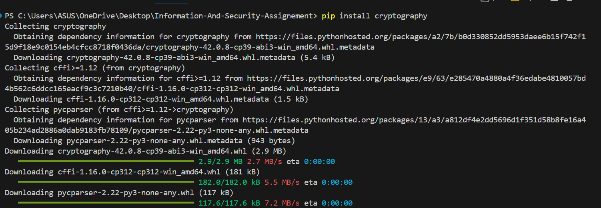

### Generating AES Key

For encryption and decryption, we need to generate an AES key. That’s why for 128 bits we create an AES key named `aes_key.bin`.
 
```
def generate_aes_key(key_size):
    return os.urandom(key_size // 8)
```

The generated `aes_key.bin` looks like this,


### Pseudocode for AES Encryption/Decryption

```
def aes_encrypt_decrypt(input_file, output_file, key, mode, iv=None, encrypt=True):
    backend = default_backend()
    block_size = algorithms.AES.block_size

    if mode == 'ECB':
        cipher_mode = modes.ECB()
    elif mode == 'CFB':
        if encrypt:
            if iv is None:
                iv = os.urandom(16)
            cipher_mode = modes.CFB(iv)
        else:
            with open(input_file, 'rb') as f:
                iv = f.read(16)
                ciphertext = f.read()
            cipher_mode = modes.CFB(iv)
    
    cipher = Cipher(algorithms.AES(key), cipher_mode, backend=backend)

    if encrypt:
        encryptor = cipher.encryptor()
        padder = sym_padding.PKCS7(block_size).padder()

        with open(input_file, 'rb') as f:
            plaintext = f.read()

        padded_plaintext = padder.update(plaintext) + padder.finalize()
        ciphertext = encryptor.update(padded_plaintext) + encryptor.finalize()

        with open(output_file, 'wb') as f:
            if mode == 'CFB':
                f.write(iv)
            f.write(ciphertext)
    else:
        decryptor = cipher.decryptor()
        unpadder = sym_padding.PKCS7(block_size).unpadder()

        with open(input_file, 'rb') as f:
            if mode != 'CFB':
                ciphertext = f.read()
            # No need to re-read the file here, already read above
            # ciphertext = f.read()
        
        padded_plaintext = decryptor.update(ciphertext) + decryptor.finalize()
        plaintext = unpadder.update(padded_plaintext) + unpadder.finalize()

        with open(output_file, 'wb') as f:
            f.write(plaintext)
```

### ECB Mode

#### <b>Encryption using 128 Bits.</b>

After that, we have created an input.txt file and encrypt it using ECB 128 bits.

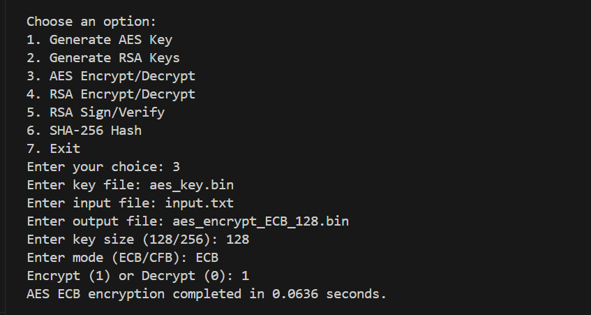

The encrypted file look like this,            

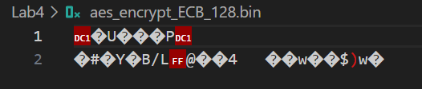


#### <b>Decryption using 128 bits</b>

After decryption,      

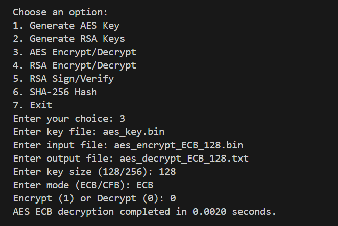

The decrypted file,        


#### <b>Encryption using 256 bits</b>

Similarly the process continue in 256 bits,

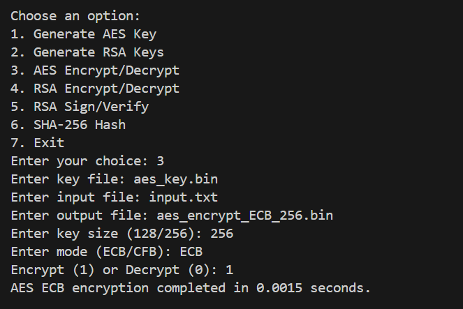

The encrypted file,

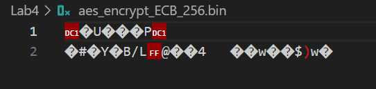


#### <b>Decryption using 256 bits</b>

And the decryption process is,

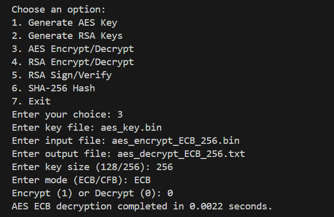

The decrypted file,


### CFB Mode
Similar process for CFB mode 128 bits and 256 bits.

#### <b>Encryption using 128 bits</b>

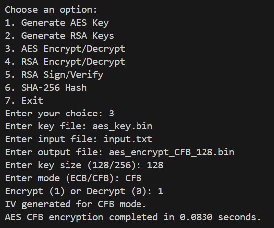

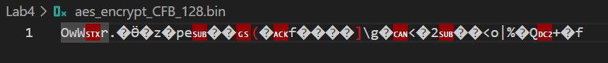


#### <b>Decryption using 128 bits</b>

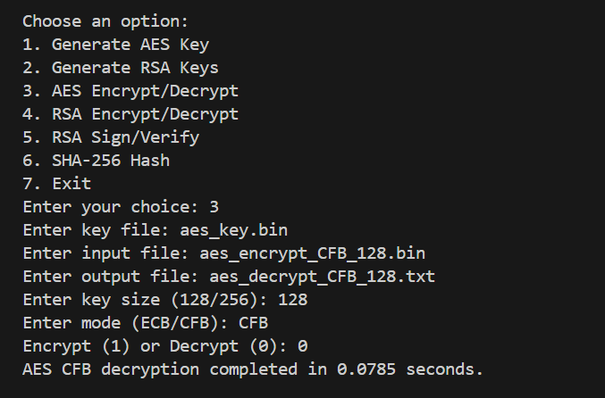

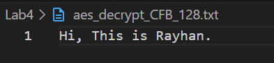


#### <b>Encryption using 256 bits</b>

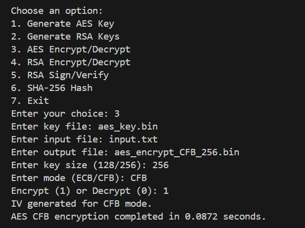

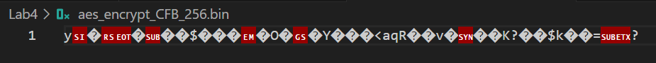


#### <b>Decryption using 256 bits</b>


