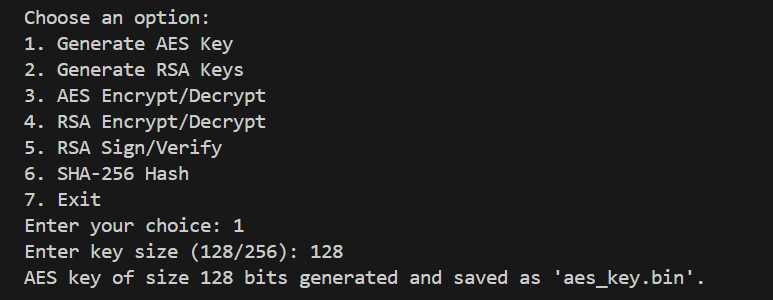

# AES Encryption/Decryption

### Prequisite
For making this whole programm runnable,there is something that need to be imported first.   
By using this command,
```
pip install cryptography
```


### Generating AES Key

For encryption and decryption, we need to generate an AES key. That’s why for 128 bits we create an AES key named `aes_key.bin`.
 
  

The generated `aes_key.bin` looks like this,


### ECB Mode

#### <b>Encryption using 128 Bits.</b>

After that, we have created an input.txt file and encrypt it using ECB 128 bits.


The encrypted file look like this,            


#### <b>Decryption using 128 bits</b>

After decryption,      


The decryption file,        


